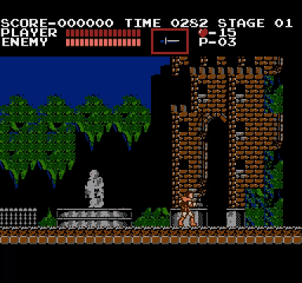

# rust-nes

This is a Nintendo emulator written in Rust.



<br />


The goal of this project is purely educational to both learn Rust and also learn more about systems programming/writing an emulator. This emulator uses NTSC timing.

The emulator supports the following mappers:
- [Mapper_000](https://wiki.nesdev.com/w/index.php/NROM) ([Supported Games](http://bootgod.dyndns.org:7777/search.php?ines=0))
- [Mapper_001](https://wiki.nesdev.com/w/index.php/MMC1) ([Supported Games](http://bootgod.dyndns.org:7777/search.php?ines=1))
- [Mapper_002](https://wiki.nesdev.com/w/index.php/UxROM) ([Supported Games](http://bootgod.dyndns.org:7777/search.php?ines=2))
- [Mapper_003](https://wiki.nesdev.com/w/index.php/INES_Mapper_003) ([Supported Games](http://bootgod.dyndns.org:7777/search.php?ines=3))
- [Mapper_004](https://wiki.nesdev.com/w/index.php/MMC3) ([Supported Games](http://bootgod.dyndns.org:7777/search.php?ines=4))
- [Mapper_066](https://wiki.nesdev.com/w/index.php/GxROM) ([Supported Games](http://bootgod.dyndns.org:7777/search.php?ines=66))

## Getting Started
### Install Rust
To run this project, Rust needs to be installed:
[Download Rust](https://www.rust-lang.org/tools/install)

### Clone repository:
```
git clone https://github.com/caklimas/rust-nes.git
```

### Build project(if you don't build under release the program will run very slowly):
```
cargo build --release
```

### Run executable
Navigate to /target/release folder.
There are two ways to run a ROM.

The first is specifying the location of a .nes or .qks file:
```
rust-nes.exe {path-to-rom}

Ex: rust-nes.exe "C:\ROMS\test-rom.nes"
```

The second is running the executable and then dragging and dropping a .nes or .qks file into the window

### Controls
This is the keyboard mapping from the NES Controller:
| NES    | Keyboard
| -------| --------
|   A    |    Z   |
|   B    |    X   |
| Start  |  Enter |
| Select | R-Shift|
|   Up   |   Up   |
|  Down  |  Down  |
|  Left  |  Left  |
|  Right |  Right |

### Extra controls
This emulator also supports quicksave and quickload. To save hit F7 which will save it under a .qks file.
To load that simply pass it in as an argument in place of the .nes file